# Список виджетов

В данной инструкции приведены наиболее часто используемые виджеты GTK+3.

?> TODO - добавить подробное описание каждого виджета, как это сделано в оригинале.

<!-- Описание каждого виджета - отдельные страницы -->

| Виджет                   | Скриншот                                                  |
|:-------------------------|-----------------------------------------------------------|
| `Gtk.AboutDialog`        | 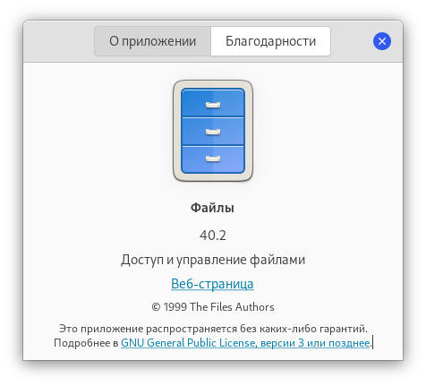           |
| `Gtk.AccelLabel`         |             |
| `Gtk.ActionBar`          |               |
| `Gtk.AppChooserButton`   |  |
| `Gtk.AppChooserDialog`   |  |
| `Gtk.Assistant`          |                |
| `Gtk.Button`             |                      |
| `Gtk.CheckButton`        | 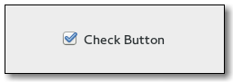          |
| `Gtk.ColorButton`        |           |
| `Gtk.ColorChooserDialog` |    |
| `Gtk.ComboBox`           |                 |
| `Gtk.ComboBoxText`       | 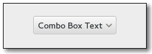       |
| `Gtk.Entry`              |                        |
| `Gtk.FileChooserButton`  |      |
| `Gtk.FileChooserDialog`  |      |
| `Gtk.FlowBox`            |                   |
| `Gtk.FontButton`         |             |
| `Gtk.FontChooserDialog`  | 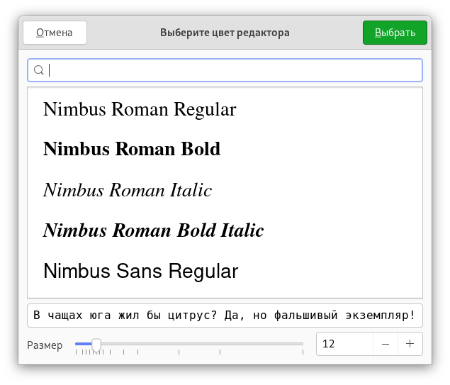     |
| `Gtk.Frame`              |                        |
| `Gtk.GLArea`             |                      |
| `Gtk.Grid`               |                  |
| `Gtk.HeaderBar`          | 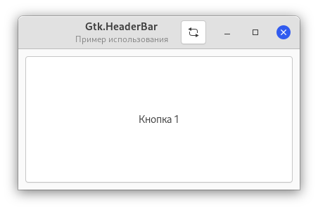               |
| `Gtk.IconView`           | 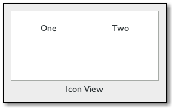                |
| `Gtk.Image`              |                        |
| `Gtk.InfoBar`            | 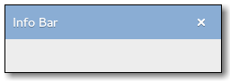                  |
| `Gtk.Label`              |                        |
| `Gtk.LevelBar`           |                  |
| `Gtk.LinkButton`         |             |
| `Gtk.ListBox`            |                   |
| `Gtk.LockButton`         |              |
| `Gtk.MenuBar`            |                   |
| `Gtk.MenuButton`         |             |
| `Gtk.MessageDialog`      | 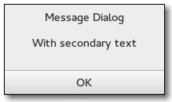       |
| `Gtk.Notebook`           | 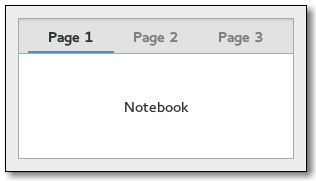                 |
| `Gtk.Paned`              |                        |
| `Gtk.PlacesSidebar`      | 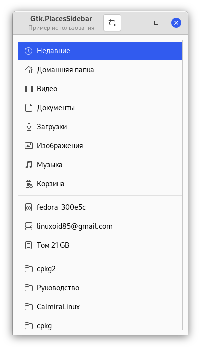       |
| `Gtk.PrograssBar`        |            |
| `Gtk.RadioButton`        | 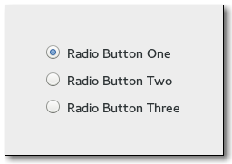           |
| `Gtk.RecentChooserDialog`| 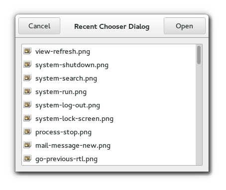 |
| `Gtk.Scale`              | 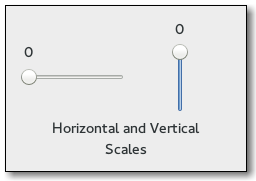                      |
| `Gtk.Scrollbar`          |                |
| `Gtk.ScrolledWindow`     |      |
| `Gtk.SearchBar`          | 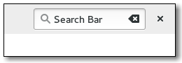              |
| `Gtk.SearchEntry`        | 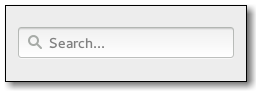          |
| `Gtk.Separator`          |                |
| `Gtk.SpinButton`         | 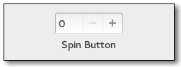           |
| `Gtk.Spinner`            |                    |
| `Gtk.Stack`              |                        |
| `Gtk.StackSwitcher`      |        |
| `Gtk.Statusbar`          |                |
| `Gtk.Switch`             | 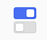                     |
| `Gtk.TextView`           | 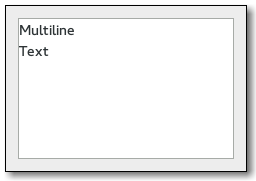           |
| `Gtk.ToolPalette`        |            |
| `Gtk.Toolbar`            |                    |
| `Gtk.TreeView`           | 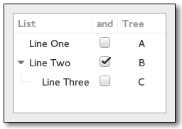            |
| `Gtk.VolumeButton`       | 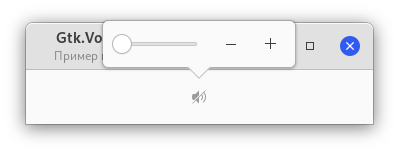         |
| `Gtk.Window`             |                      |
