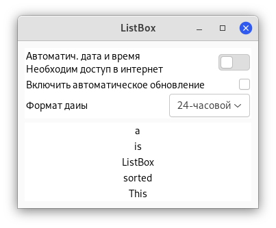

# Контейнеры макета

В то время как многие наборы инструментов GUI требуют, чтобы вы точно размещали виджеты в окне, используя абсолютное позиционирование, GTK+ использует иной подход. Вместо того, чтобы указывать положение и размер каждого виджета в окне, вы можете расположить свои виджеты в строках, столбцах и/или таблицах. Размер вашего окна может быть определён автоматически на основе размеров содержащихся в нём виджетов. И размеры виджетов, в свою очередь, определяются объёмом текста, который они содержат, или минимальными и максимальными размерами, которые вы установили, и/или тем, как вы запросили, чтобы доступное пространство было разделено между наборами виджетов. Вы можете улучшить свой макет, указав расстояние заполнения и значения центрирования для каждого из виджетов. Вы можете улучшить свой макет, указав расстояние заполнения и значения центрирования для каждого из виджетов. GTK+ затем использует всю эту информацию, чтобы разумно и плавно изменять размер и положение всего, когда пользователь манипулирует окном.

GTK+ упорядочивает виджеты иерархически, используя *контейнеры*. Они невидимы для конечного пользователя и вставляются в окно или перемещаются друг в друга для компонентов макета. Есть два вида контейнеров: контейнеры с одним дочерним элементом, которые являются потомком `Gtk.Bin`, и контейнеры с несколькими дочерними элементами, которые являются потомками `Gtk.Container`. Чаще всего используются горизонтальные или вертикальные блоки (`Gtk.Box`) и сетки (`Gtk.Grid`).

## Блоки (boxes)

Блоки - это невидимые контейнеры, в которые можно упаковать виджеты. При упаковке виджетов в горизонтальный блок объекты вставляются горизонтально слева направо или справа налево в зависимости от того, используется ли `Gtk.Box.pack_start()` или `Gtk.Box.pack_end()`. В вертикальном поле виджеты упакованы сверху вниз или наоборот. Вы можете использовать любую комбинацию блоков внутри или рядом с другими ячейками для создания желаемого эффекта.

### Пример

Посмотрим на слегка изменённую версию расширенного примера с двумя кнопками.


```python
#!/bin/python3
import gi

gi.require_version("Gtk", "3.0")
from gi.repository import Gtk


class MyWindow(Gtk.Window):
    def __init__(self):
        super().__init__(title="Привет, мир")

        self.box = Gtk.Box(spacing=6)
        self.add(self.box)

        self.button1 = Gtk.Button(label="Привет")
        self.button1.connect("clicked", self.on_button1_clicked)
        self.box.pack_start(self.button1, True, True, 0)

        self.button2 = Gtk.Button(label="Пока")
        self.button2.connect("clicked", self.on_button2_clicked)
        self.box.pack_start(self.button2, True, True, 0)

    def on_button1_clicked(self, widget):
        print("Hello")

    def on_button2_clicked(self, widget):
        print("Goodbye")


win = MyWindow()
win.connect("destroy", Gtk.main_quit)
win.show_all()
Gtk.main()
```

Вывод в терминал будет таким:


Сначала создаётся горизонтально ориентированный контейнер-бокс, в котором между дочерними элементами размещается 6 пикселей. Этот блок становится дочерним элементом окна верхнего уровня:

```python
        self.box = Gtk.Box(spacing=6)
        self.add(self.box)
```

После чего помещаем две кнопки в контейнер бокса:

```python
        self.button1 = Gtk.Button(label="Привет")
        self.button1.connect("clicked", self.on_button1_clicked)
        self.box.pack_start(self.button1, True, True, 0)

        self.button2 = Gtk.Button(label="Пока")
        self.button2.connect("clicked", self.on_button2_clicked)
        self.box.pack_start(self.button2, True, True, 0)
```

В то время как в `Gtk.Box.pack_start()` виджеты располагаются слева направо, `Gtk.Box.pack_end()` располагает их справа налево.

## Сетки (grid)

`Gtk.Grid` - это контейнер, в котором дочерние виджеты располагаются в строках и столбцах, но вам не нужно указывать параметры в конструкторе. Потомки добавляются с помощью `Gtk.Grid.attach()`. Они могут охватывать несколько строк или столбцов. Метод `Gtk.Grid.attach()` принимает пять параметров:

1. Параметр `child` - это добавляемый [`Gtk.Widget`](https://lazka.github.io/pgi-docs/Gtk-3.0/classes/Widget.html#Gtk.Widget);
2. `left` - это номер столбца
3. `top` указывает номер строки, к которой нужно прикрепить верхнюю часть элемента `child`;
4. `width` и `height` указывают количество столбцов, которые будут охватывать элемент `child`, и кол-во строк, которые будут охватывать этот элемент, соответственно.

Также можно добавить новый дочерний элемент рядом с существующим дочерним, используя `Gtk.Grid.attach_next_to()`, который также принимает пять параметров:

1. `child` - это добавляемый [`Gtk.Widget`](https://lazka.github.io/pgi-docs/Gtk-3.0/classes/Widget.html#Gtk.Widget), как указано выше;
2. `sibling` - это существующий дочерний виджет `self` (экземпляр [`Gtk.Grid`](https://lazka.github.io/pgi-docs/Gtk-3.0/classes/Grid.html#Gtk.Grid) или `None`. Виджет `child` будет размещён рядом с одноуровневым элементом или, если одноуровневый виджет `sibling` as `None`, в начале или конце сетки.

Наконец, [`Gtk.Grid`](https://lazka.github.io/pgi-docs/Gtk-3.0/classes/Grid.html#Gtk.Grid) можно использовать как [`Gtk.Box`](https://lazka.github.io/pgi-docs/Gtk-3.0/classes/Box.html#Gtk.Box), просто используя `Gtk.Grid.add()`, который замещает дочерние элементы рядом друг с другом в направлении, определяемым свойством "orientation" (по умолчанию [`Gtk.Orientation.HORISONTAL`](https://lazka.github.io/pgi-docs/Gtk-3.0/enums.html#Gtk.Orientation.HORIZONTAL).

### Пример


```python
#!/bin/python3

import gi

gi.require_version("Gtk", "3.0")
from gi.repository import Gtk


class GridWindow(Gtk.Window):
    def __init__(self):

        super().__init__(title="Grid Example")

        button1 = Gtk.Button(label="Кнопка 1")
        button2 = Gtk.Button(label="Кнопка 2")
        button3 = Gtk.Button(label="Кнопка 3")
        button4 = Gtk.Button(label="Кнопка 4")
        button5 = Gtk.Button(label="Кнопка 5")
        button6 = Gtk.Button(label="Кнопка 6")

        grid = Gtk.Grid()
        grid.add(button1)
        grid.attach(button2, 1, 0, 2, 1)
        grid.attach_next_to(button3, button1, Gtk.PositionType.BOTTOM, 1, 2)
        grid.attach_next_to(button4, button3, Gtk.PositionType.RIGHT, 2, 1)
        grid.attach(button5, 1, 2, 1, 1)
        grid.attach_next_to(button6, button5, Gtk.PositionType.RIGHT, 1, 1)

        self.add(grid)


win = GridWindow()
win.connect("destroy", Gtk.main_quit)
win.show_all()
Gtk.main()
```

## ListBox

[Gtk.ListBox](https://lazka.github.io/pgi-docs/Gtk-3.0/classes/ListBox.html#Gtk.ListBox) - это вертикальный контейнер, содержащий дочерние элементы [`Gtk.ListBoxRow`](https://lazka.github.io/pgi-docs/Gtk-3.0/classes/ListBoxRow.html#Gtk.ListBoxRow). Эти строки можно динамически сортировать и фильтровать, а заголовки можно добавлять динамически в зависимости от содержимого строки. Он так же позволяет осуществлять навигацию и выбор с помощью клавиатуры и мыши, как в обычном списке.

Использование `Gtk.ListBox` часто является альтернативой [`Gtk.TreeView`](https://lazka.github.io/pgi-docs/Gtk-3.0/classes/TreeView.html#Gtk.TreeView), особенно когда содержимое списка имеет более сложную компоновку, чем то, что разрешено [`Gtk.CellRenderer`](https://lazka.github.io/pgi-docs/Gtk-3.0/classes/CellRenderer.html#Gtk.CellRenderer), или когда содержимое является интерактивным (например, в нём есть кнопка).

Хотя `Gtk.ListBox` должен иметь только дочерние элементы `Gtk.ListBoxRow`, вы можете добавить к нему любой виджет [`Gtk.Container.add()`](https://lazka.github.io/pgi-docs/Gtk-3.0/classes/Container.html#Gtk.Container.add), и виджет `Gtk.ListBoxRow` будет автоматически вставлен между списком и виджетом.

### Пример



```python
#!/bin/python3

import gi

gi.require_version("Gtk", "3.0")
from gi.repository import Gtk


class ListBoxRowWithData(Gtk.ListBoxRow):
    def __init__(self, data):
        super().__init__()
        self.data = data
        self.add(Gtk.Label(label=data))


class ListBoxWindow(Gtk.Window):
    def __init__(self):
        super().__init__(title="ListBox")
        self.set_border_width(10)

        box_outer = Gtk.Box(orientation=Gtk.Orientation.VERTICAL, spacing=6)
        self.add(box_outer)

        listbox = Gtk.ListBox()
        listbox.set_selection_mode(Gtk.SelectionMode.NONE)
        box_outer.pack_start(listbox, True, True, 0)

        row = Gtk.ListBoxRow()
        hbox = Gtk.Box(orientation=Gtk.Orientation.HORIZONTAL, spacing=50)
        row.add(hbox)
        vbox = Gtk.Box(orientation=Gtk.Orientation.VERTICAL)
        hbox.pack_start(vbox, True, True, 0)

        label1 = Gtk.Label(label="Автоматич. дата и время", xalign=0)
        label2 = Gtk.Label(label="Необходим доступ в интернет", xalign=0)
        vbox.pack_start(label1, True, True, 0)
        vbox.pack_start(label2, True, True, 0)

        switch = Gtk.Switch()
        switch.props.valign = Gtk.Align.CENTER
        hbox.pack_start(switch, False, True, 0)

        listbox.add(row)

        row = Gtk.ListBoxRow()
        hbox = Gtk.Box(orientation=Gtk.Orientation.HORIZONTAL, spacing=50)
        row.add(hbox)
        label = Gtk.Label(label="Включить автоматическое обновление", xalign=0)
        check = Gtk.CheckButton()
        hbox.pack_start(label, True, True, 0)
        hbox.pack_start(check, False, True, 0)

        listbox.add(row)

        row = Gtk.ListBoxRow()
        hbox = Gtk.Box(orientation=Gtk.Orientation.HORIZONTAL, spacing=50)
        row.add(hbox)
        label = Gtk.Label(label="Формат даиы", xalign=0)
        combo = Gtk.ComboBoxText()
        combo.insert(0, "0", "24-часовой")
        combo.insert(1, "1", "12-часовой")
        hbox.pack_start(label, True, True, 0)
        hbox.pack_start(combo, False, True, 0)

        listbox.add(row)

        listbox_2 = Gtk.ListBox()
        items = "This is a sorted ListBox Fail".split()

        for item in items:
            listbox_2.add(ListBoxRowWithData(item))

        def sort_func(row_1, row_2, data, notify_destroy):
            return row_1.data.lower() > row_2.data.lower()

        def filter_func(row, data, notify_destroy):
            return False if row.data == "Fail" else True

        listbox_2.set_sort_func(sort_func, None, False)
        listbox_2.set_filter_func(filter_func, None, False)

        def on_row_activated(listbox_widget, row):
            print(row.data)

        listbox_2.connect("row-activated", on_row_activated)

        box_outer.pack_start(listbox_2, True, True, 0)
        listbox_2.show_all()


win = ListBoxWindow()
win.connect("destroy", Gtk.main_quit)
win.show_all()
Gtk.main()
```
