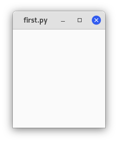

# Начиная

## Простой пример

Начнём с малого. Создадим пустое окно 200х200 pic:

```python
#!/usr/bin/python3
import gi

gi.require_version("Gtk", "3.0")
from gi.repository import Gtk

win = Gtk.Window()
win.connect("destroy", Gtk.main_quit)
win.show_all()
Gtk.main()
```

Теперь мы объясним каждую строчку кода.

```python
import gi

gi.require_version("Gtk", "3.0")
from gi.repository import Gtk
```

Вы должны импортировать модуль Gtk, чтобы иметь доступ к классам и функциям GTK+. В системе пользователя может ыбть установлено несколько версий GTK+ одновременно, поэтому нужно убедиться, что при импорте Gtk он будет ссылаться на GTK+3, а не на любую другую версию библиотеки, что является целью оператора `gi.require_version("Gtk", "3.0")`.

Следующее создаёт пустое окно:

```python
win = Gtk.Window()
```

Затем выполняется подключение к событию удаления окна, чтобы гарантировать завершение работы приложения, если мы щёлкнем по `X`, чтобы закрыть окно.

```python
win.connect("destroy", Gtk.main_quit)
```

Следующее показывает окно на экран:

```python
win.show_all()
```

Наконец, запускаем цикл обработки GTK+, который завершаем при закрытии окна (см шестую строку):

```python
Gtk.main()
```

Для запуска программы выполните:

```bash
chmod +x example1.py
./example1.py
```

Откроется следующее окно:



## Расширенный пример

Версия "классического" Hello World:

```python
import gi

gi.require_version("Gtk", "3.0")
from gi.repository import Gtk


class MyWindow(Gtk.Window):
    def __init__(self):
        super().__init__(title="Hello World")

        self.button = Gtk.Button(label="Нажми на меня")
        self.button.connect("clicked", self.on_button_clicked)
        self.add(self.button)

    def on_button_clicked(self, widget):
        print("Hello World")


win = MyWindow()
win.connect("destroy", Gtk.main_quit)
win.show_all()
Gtk.main()
```

Этот пример отличается от предыдущего тем, что мы создаём подкласс `Gtk.Window` для определения нашего собственного класса `MyWindow`:

``` python
class MyWindow(Gtk.Window):
```

В конструкторе класса мы должны вызвать конструктор суперкласса. Кроме того, мы говорим ему установить значение свойства `title` на *`Hello World`*

```python
        super().__init__(title="Hello World")
```

Следующие три строки используются для создания виджета кнопки, подключения к его сигналу нажатия и добавления его в качестве дочернего элемента в окно верхнего уровня.

```python
        self.button = Gtk.Button(label="Нажми на меня")
        self.button.connect("clicked", self.on_button_clicked)
        self.add(self.button)
```

Соответственно, метод `on_button_clicked()` будет вызываться, если вы нажмёте на кнопку.

```python
    def on_button_clicked(self, widget):
        print("Hello World")
```

Последний блок вне класса очень похож на пример выше, но вместо создания экземпляра общего класса `Gtk.Window` мы создаём экземпляр `MyWindow`.

Откроется соедующее окно:


Вывод в терминал:


